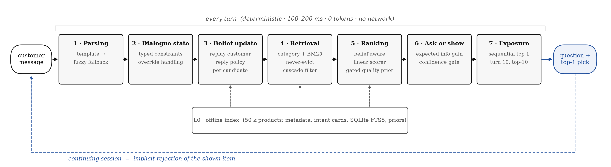

# 3W1Y ShoppingBot — Conversational Product Search Agent

3W1Y ShoppingBot is a deterministic, multi-turn shopping agent built for the
TechJam Conversational Search challenge. It tracks evolving user intent,
retrieves from a 50,000-product Amazon catalog, asks targeted clarification
questions, and recommends products without an LLM or external API.

## 1. Results

| Evaluation | TechnicalScore | Hit@10 | MRR | MTTC |
|---|---:|---:|---:|---:|
| Official evaluator · 200 public sessions | **0.9801** | **1.000** | **1.000** | **1.995** |
| Paraphrase stress · Level 1 | **0.9801** | **1.000** | **1.000** | **1.995** |
| Paraphrase stress · Level 2 | **0.9800** | **1.000** | **1.000** | **2.000** |

| Runtime profile | Value |
|---|---|
| Core runtime | Python 3.10+ standard library |
| Inference | Deterministic and fully offline |
| LLM / external API | None |
| Token usage / model cost | 0 / $0 |
| Typical turn latency | Approximately 100–200 ms |
| First index build | Approximately 30–60 seconds |

## 2. Architecture

A simplified view of the per-turn agent pipeline:



The official Agent interface and Web console use the same search pipeline. The
Web layer accesses the algorithm only through `ShoppingCopilotRuntime`, keeping
the interface independent from parsing, retrieval, ranking, and dialogue logic.

## 3. Solution approach

- **Intent routing and hybrid retrieval:** template and fuzzy parsing distinguish
  buying, browsing, and intent changes; category, constraint, and BM25 signals
  retrieve candidates with a never-evict fallback.
- **Multi-turn state:** typed slots accumulate across turns, while intent
  overrides reset incompatible state and previous recommendations provide
  implicit negative feedback.
- **Adaptive ranking:** catalog-grounded belief updates combine conversation
  evidence with constraint, quality, popularity, and user-profile signals.
- **Active guidance:** expected information gain determines when to clarify;
  sequential Top-1 exposure and a final Top-10 fallback balance precision,
  coverage, and conversion speed.

## 4. Setup and installation

Requirements: **Python 3.10+**.

The official participant kit and catalog are required at runtime. Place them at
the expected paths using the commands for your operating system.

### Windows (PowerShell)

```powershell
# 1. clone this repo and enter it
git clone https://github.com/app9988/Competition2026.git
cd Competition2026

# 2. clone the official kit INTO the repo root (exact folder name matters -
# the eval scripts look for ..\techjam-conversational-search)
git clone https://github.com/TechJam2026/techjam-conversational-search.git

# 3. download the catalog from the kit's GitHub Release and decompress it
# (Python-only, no extra tools; each command prints a confirmation.
# Alternatively download catalog.jsonl.gz from the Release page in a
# browser into techjam-conversational-search\data\ and run the second
# command to decompress.)
cd techjam-conversational-search
python -c "import urllib.request as u; u.urlretrieve('https://github.com/TechJam2026/techjam-conversational-search/releases/download/participant-kit/catalog.jsonl.gz','data/catalog.jsonl.gz'); print('downloaded')"
python -c "import gzip,shutil; shutil.copyfileobj(gzip.open('data/catalog.jsonl.gz','rb'), open('data/catalog.jsonl','wb')); print('decompressed')"
cd ..
```

### macOS / Linux

```bash
# 1. clone this repo and enter it
git clone https://github.com/app9988/Competition2026.git
cd Competition2026

# 2. clone the official kit into the repo root
git clone https://github.com/TechJam2026/techjam-conversational-search.git

# 3. download and decompress the catalog
cd techjam-conversational-search
python3 -c "import urllib.request as u; u.urlretrieve('https://github.com/TechJam2026/techjam-conversational-search/releases/download/participant-kit/catalog.jsonl.gz','data/catalog.jsonl.gz'); print('downloaded')"
python3 -c "import gzip,shutil; shutil.copyfileobj(gzip.open('data/catalog.jsonl.gz','rb'), open('data/catalog.jsonl','wb')); print('decompressed')"
cd ..
```

The core Agent has no third-party dependencies.

## 5. Run the evaluation

Run the official 200-session evaluation from the repository root:

**Windows:**

```powershell
python run_official.py
```

**macOS / Linux:**

```bash
python3 run_official.py
```

Run the instrumented evaluator for per-session and L1–L7 reports:

**Windows:**

```powershell
cd shopping-copilot
python scripts\run_eval.py
```

**macOS / Linux:**

```bash
cd shopping-copilot
python3 scripts/run_eval.py
```

Optional paraphrase stress evaluation:

**Windows:**

```powershell
python scripts\run_eval.py --paraphrase 1
python scripts\run_eval.py --paraphrase 2
```

**macOS / Linux:**

```bash
python3 scripts/run_eval.py --paraphrase 1
python3 scripts/run_eval.py --paraphrase 2
```

## 6. Web evaluation console

**Windows:**

```powershell
python -m pip install -r shopping-copilot-web\backend\requirements.txt
cd shopping-copilot-web
python -m backend.app
```

**macOS / Linux:**

```bash
python3 -m pip install -r shopping-copilot-web/backend/requirements.txt
cd shopping-copilot-web
python3 -m backend.app
```

Open [http://127.0.0.1:8000/](http://127.0.0.1:8000/).

The console supports full 20/50/100/200-session evaluation and turn-by-turn
single-session replay with recommendations, candidate rankings, metrics, and
diagnostics. During the first index build, an animated loading screen displays
progress and automatically enters the console when the runtime is ready.

## 7. Repository structure

```text
├─ agent.py                         # Official Agent export
├─ run_official.py                  # Official evaluation entry point
├─ shopping-copilot/
│  ├─ configs/default.json          # Runtime configuration
│  ├─ src/copilot/                  # Core algorithms and public runtime
│  ├─ scripts/run_eval.py           # Instrumented evaluator
│  └─ tests/                        # Algorithm regression tests
├─ shopping-copilot-web/
│  ├─ backend/                      # FastAPI application
│  ├─ static/                       # HTML, CSS and JavaScript
│  └─ tests/                        # Web/API contract tests
└─ submission/                      # Competition submission bundle
```

## 8. Limitations and future work

- The catalog-grounded belief update is designed around the official
  deterministic simulator; its generalization to unrestricted human dialogue
  requires further validation.
- Retrieval currently relies on category, constraint, and BM25 signals. A
  lightweight in-memory dense retriever could improve open-ended browsing.
- The current system focuses on English text and isolated sessions. Future work
  could add multilingual understanding and cross-session user profiles.

## 9. Team member contributions

- **Yang Nan** — core algorithm and system architecture: redesigned the agent as
  the seven-stage hybrid pipeline; implemented dynamic dialogue/override state,
  catalog-grounded belief updates, never-evict constraint retrieval,
  belief-aware ranking and active clarification; implemented L1–L7 pipeline
  tracing and diagnostic metrics; introduced the stable public runtime boundary
  that decouples the algorithm from the Web presentation layer.
- **Zheng Yiting** — evaluation and robustness: paraphrase stress testing,
  cross-harness validation, ablation studies, adversarial/contract checks, and
  cross-platform reproducibility verification.
- **Weng Peng Ju** — evaluation experience and interface design: conversation
  replay, candidate-ranking presentation, the Full Evaluation dashboard,
  responsive UX, and the English interface.
- **Wang Chia Chi** — submission engineering and presentation: competition-rule
  compliance, submission packaging, documentation narrative, Devpost content,
  demo-video production, and voiceover.
