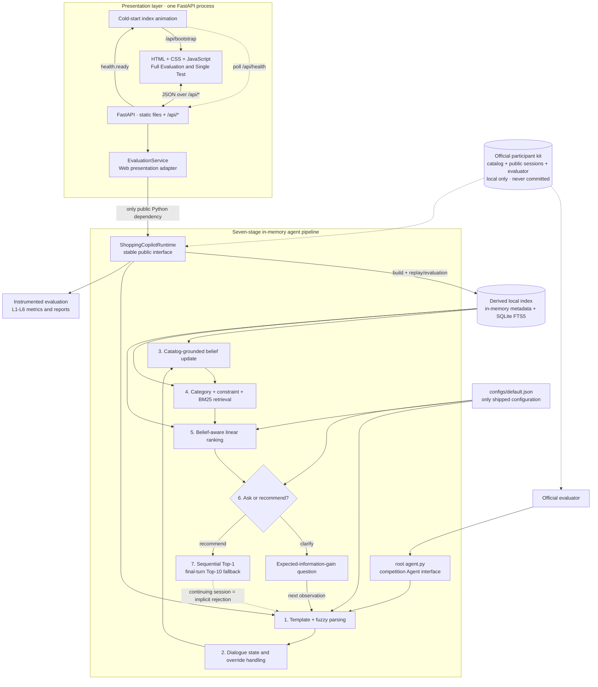

# 3W1Y ShoppingBot — Conversational Product Search Agent

A deterministic, multi-turn shopping agent for the TechJam Conversational Search
challenge. It tracks changing intent, retrieves from a 50,000-product catalog,
asks high-value clarification questions, and recommends the most likely product
without calling an LLM or any external service during evaluation.

## 1. Project overview

### Public-set results

| Evaluation | TechnicalScore | Hit@10 | MRR | MTTC |
|---|---:|---:|---:|---:|
| Official evaluator, 200 sessions | **0.9801** | **1.000** | **1.000** | **1.995** |
| Heavy paraphrase stress, 200 sessions | **0.9800** | **1.000** | **1.000** | **2.000** |

The final official run also reaches Rank 1 in all 200 public sessions. Mean
per-turn latency in the instrumented run is approximately 152 ms on the
development machine.

### Architecture



A simplified view of the per-turn agent pipeline:


The browser never imports algorithm code. FastAPI exposes a small HTTP contract,
and its presentation adapter imports only
`copilot.public_api.ShoppingCopilotRuntime`. Parsing, routing, retrieval,
ranking, dialogue state and evaluator integration remain private to the agent
package.

### Repository layout

```text
├─ agent.py                         # official Agent export
├─ run_official.py                  # one-command official evaluation
├─ shopping-copilot/
│  ├─ configs/default.json          # sole production configuration
│  ├─ src/copilot/                  # algorithms and public runtime interface
│  ├─ scripts/run_eval.py           # instrumented evaluator
│  └─ tests/                        # algorithm regression tests
├─ shopping-copilot-web/
│  ├─ backend/                      # FastAPI transport and report adapter
│  ├─ static/                       # framework-free HTML, CSS and JavaScript
│  └─ tests/                        # Web/API contract tests
└─ submission/                      # competition submission bundle
```

The organizer repository and catalog are intentionally excluded. They must be
cloned/downloaded locally using the next section before evaluation or Web use.

### Model, latency, tokens and cost

- **Model:** no LLM and no learned neural model. The submitted system is a
  deterministic, interpretable seven-stage pipeline.
- **Latency:** approximately 100–200 ms per `respond()`, depending on hardware
  and candidate-pool size.
- **Cold start:** building the in-memory and SQLite-backed indexes can take
  roughly 30–60 seconds; subsequent starts use the local cache.
- **Token usage:** 0 prompt tokens and 0 completion tokens.
- **Estimated model cost:** $0.
- **Evaluation network access:** none. No API keys or credentials are required.

## 2. Setup and installation

Requirements: **Python 3.10+**. Node.js, npm, React and a frontend build step are
not required.

The following PowerShell workflow is intentionally retained because competition
rules do not allow the official kit or catalog to be committed to this
repository.

```powershell
# 1. clone this repo and enter it
git clone https://github.com/app9988/Competition2026.git -b main
cd Competition2026

# 2. clone the official kit INTO the repo root (exact folder name matters -
#    the eval scripts look for ..\techjam-conversational-search)
git clone https://github.com/TechJam2026/techjam-conversational-search.git

# 3. download the catalog from the kit's GitHub Release and decompress it
#    (Python-only, no extra tools; each command prints a confirmation.
#     Alternatively download catalog.jsonl.gz from the Release page in a
#     browser into techjam-conversational-search\data\ and run the second
#     command to decompress.)
cd techjam-conversational-search
python -c "import urllib.request as u; u.urlretrieve('https://github.com/TechJam2026/techjam-conversational-search/releases/download/participant-kit/catalog.jsonl.gz','data/catalog.jsonl.gz'); print('downloaded')"
python -c "import gzip,shutil; shutil.copyfileobj(gzip.open('data/catalog.jsonl.gz','rb'), open('data/catalog.jsonl','wb')); print('decompressed')"
cd ..

# 4. create and activate a virtual environment
python -m venv .venv
.\.venv\Scripts\Activate.ps1
```

The core Agent uses only the Python standard library. Install the optional Web
console dependency only when you want to run the interface:

```powershell
python -m pip install -r shopping-copilot-web\backend\requirements.txt
```

> **Linux/macOS:** use `python3` in place of `python`, activate with
> `source .venv/bin/activate`, and use `/` path separators.

## 3. Reproduce the results

Run the official harness from the repository root after completing the official
kit and catalog steps above:

```powershell
python run_official.py
# TechnicalScore = 0.9801
# Hit@10 = 1.0  MRR = 1.0  MTTC = 1.995
```

For detailed per-session, per-turn and L1–L6 reports:

```powershell
cd shopping-copilot

# Official 200-session run
python scripts\run_eval.py

# Optional robustness runs (our own paraphrase stress sets, not officially scored)
# expect: 0.9801 (level 1) and 0.9800 (level 2), Hit@10 and MRR still 1.0
python scripts\run_eval.py --paraphrase 1
python scripts\run_eval.py --paraphrase 2
```

Generated indexes and reports are written to `shopping-copilot/cache/` and
`shopping-copilot/runs/`. Both directories are local artifacts derived from
the official kit and are intentionally ignored by Git.

### Official Agent interface

The root `agent.py` exports the required `Agent` class.

> **Prerequisite**: complete section 2 first — the official kit must be cloned into
> the repository root and `catalog.jsonl` downloaded. The snippet below is then
> runnable as-is from the repository root:

```python
from agent import Agent

agent = Agent(
    catalog_path="techjam-conversational-search/data/catalog.jsonl"
)
agent.reset(
    "demo-session",
    {
        "purchase_frequency": "high",
        "average_prior_rating": 4.2,
        "rating_style": "balanced",
        "preference_tags": [],
        "summary": "",
    },
)
reply = agent.respond(
    "demo-session",
    "I am looking for a leather belt with buckle closure",
    1,
    10,
)
print(reply["message"])
print(reply["recommendations"])
```

`respond()` degrades to a schema-valid fallback response if an internal
exception occurs, preventing one malformed turn from invalidating a session.

## 4. Lightweight Web evaluation console

The interface now runs as one process. FastAPI serves both the static page and
the JSON API; there is no Node.js server or proxy.

```powershell
cd shopping-copilot-web
python -m backend.app
```

Open [http://127.0.0.1:8000/](http://127.0.0.1:8000/).

On first launch, static HTML appears immediately with an animated catalog-index
builder. The page polls `/api/health` and automatically enters the evaluation
console as soon as the indexes are ready.

- **Full Evaluation:** run 20/50/100/200 sessions, select one of three
  paraphrase levels, follow live progress, inspect overall/scenario metrics,
  monitor L1–L6 link health, search results and open the detail drawer.
- **Single Test:** replay any public session turn by turn with user/agent
  messages, recommendations, the top-five candidate preview, Event/Gate/Pool/
  Latency diagnostics, final product and score breakdown.
- **Default-only configuration:** the Web API accepts only `default.json`.

## 5. Algorithm design

1. **Hybrid parsing.** A high-precision template parser handles canonical
   messages, while the fuzzy parser handles free-form browsing, hyphenated
   categories, no-preference responses and paraphrased intent overrides.
2. **Dynamic state.** Typed slots accumulate across turns. An explicit intent
   override clears incompatible exposure state and rewrites the affected
   constraint.
3. **Catalog-grounded belief.** For every candidate, the runtime replays the
   published customer-response policy and compares predicted responses with the
   ordered observations. This provides a lightweight posterior-like ranking
   signal without model training.
4. **Never-evict retrieval.** Category, constraint and BM25 channels form an
   in-memory candidate cascade. A low-confidence constraint filters only when a
   non-trivial survivor set remains.
5. **Belief-aware ranking.** An interpretable linear scorer combines belief
   likelihood, constraint coverage, intent-card overlap, category, BM25,
   popularity, quality and profile signals.
6. **Active clarification.** Expected information gain proposes the most useful
   attribute; a confidence gate decides whether asking is worth another turn.
7. **Metric-aware exposure.** Sequential Top-1 minimizes MRR and MTTC cost, with
   a Top-10 final-turn fallback to protect catalog recall.

The same run also records semantically correct parsing coverage, actual
candidate membership and eligible ranking turns, so L1–L6 diagnostics measure
the real pipeline rather than incidental trace fields.

## 6. Validation

```powershell
# Algorithm regressions
cd shopping-copilot
python -m unittest tests.test_algorithm_regressions -v
cd ..

# Web/API contract
cd shopping-copilot-web
python -m unittest discover -s tests -p "test_*.py" -v
cd ..

# Official kit evaluator tests
cd techjam-conversational-search
python -m pytest tests -q
```

The current revision passes 6 algorithm regressions, 6 Web/API contract tests
and all 3 official evaluator tests.

## 7. Robustness beyond the benchmark

The official score only measures 200 fixed sessions. To know how the system
behaves *off-script*, we built additional test infrastructure on top of the
official evaluator:

- **Two self-built paraphrase stress sets.** The same 200 sessions with every
  customer message rewritten at two intensity levels. The final agent holds
  **0.9801 / 0.9800 with Hit@10 and MRR still 1.0**
  (`run_eval.py --paraphrase 1|2`, reproducible above).
- **Ablation honesty.** A deterministic-only configuration scores 0.97 on exact
  official phrasing but **collapses to 0.0047** under even the mildest paraphrase
  set — that single measurement is why the shipped config is the hybrid parser
  cascade with never-evict retrieval backoff.
- **Cross-harness validation.** We developed two competing agent architectures in
  parallel, each with an independently written paraphrase harness, and tested each
  agent against the *other's* harness. Self-made tests flatter their own agent;
  the independent harness exposed real free-form parsing gaps that drove the
  fuzzy-parser expansion and the final-turn exposure fallback we shipped.
- **Negative results are documented, not discarded.** An aggressive 3/5/10
  exposure-widening schedule and an NQC-style dispersion gate were both
  implemented, measured, shown inferior, and rejected with the numbers recorded.
  The shipped final-turn-only fallback is Pareto-safe: it extends worst-case
  coverage without changing any session the original policy already won.

## 8. Limitations

- The catalog-grounded belief likelihood intentionally models the published
  deterministic simulator. Unconstrained production dialogue would require a
  calibrated semantic likelihood or fallback model.
- Sequential Top-1 is aligned with the competition metrics. A production
  shopping experience would normally expose a broader comparison set.
- Free-form robustness is measured with two local paraphrase levels, not with
  unrestricted human traffic.
- The current language pipeline is English-only.
- The Web console is designed for local evaluation because it reads the frozen
  catalog and runs the Python agent in memory.

## 9. Team member contributions

- **Yang Nan** — core algorithm and system architecture: redesigned the agent as
  the seven-stage hybrid pipeline; implemented dynamic dialogue/override state,
  catalog-grounded belief updates, never-evict constraint retrieval,
  belief-aware ranking and active clarification; repaired L1–L6 observability;
  introduced the stable public runtime boundary that decouples the algorithm
  from the Web presentation layer.
- **Zheng Yiting** — evaluation and robustness: paraphrase stress testing,
  cross-harness validation, ablation studies, adversarial/contract checks and
  cross-platform reproducibility verification.
- **Weng Peng Ju** — evaluation experience and interface design: conversation
  replay, candidate-ranking presentation, the Full Evaluation dashboard,
  responsive UX and the English interface.
- **Wang Chia Chi** — submission engineering and presentation: competition-rule
  compliance, submission packaging, documentation narrative, Devpost content,
  demo-video production and voiceover.
