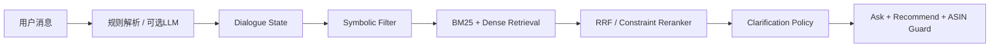

# 大模型（LLM）与对话推荐系统结合：面向固定 Catalog 的工程分析

## 执行摘要

LLM 最适合做低置信需求解析、歧义/否定/改口理解和自然问题生成，可选用于合法 Top-N 偏好重排；主要风险是幻觉、延迟与网络依赖。正式路径应坚持 offline-first：商品事实、候选集与 ID 均由固定 catalog 控制。LLM 不应生成 ASIN，唯一合法路径是 `row_id → catalog → parent_asin`，检索系统始终是 source of truth。【资料事实】

---

## 1. LLM 最值得做的是“听懂用户”，不是“替系统猜商品”

用户说：“想要正式一点，但不要太老气，预算别太高。”规则很容易识别“预算”，却难处理三个问题：`正式一点`是程度型偏好，`不要太老气`包含否定和隐含风格判断，`别太高`又取决于品类和上下文。单纯关键词无法可靠判断它们到底是 hard constraint 还是 soft preference。

【资料事实】现有方案已经把 category、budget、color、material、size、style、feature、use case、negative、no-preference 和 override 纳入状态，并规定复杂表达只能让 LLM 输出 **state delta**，而不是推荐商品。

| 方案 | 最适合处理 | 不适合 |
|---|---|---|
| 规则解析器 | 数字价格、尺码、明确颜色、`not/under/instead` | 模糊风格、隐含比较 |
| Embedding / classifier | category、use case、语义近义表达 | 精确数值、复杂否定、状态覆盖 |
| 小型本地 LLM | 模糊偏好、否定、no preference、Intent Override | 商品事实、商品 ID |
| 云端 LLM | 最复杂语言歧义、对照实验 | official critical path、敏感完整对话 |

【文献依据】LLM-CRS 的核心结论正是：LLM 的语言能力与传统推荐系统的领域知识是互补关系，而非让 LLM 取代推荐系统。RA-Rec 也表明 semi-structured state tracking 是把 LLM 接入 CRS 的有效接口。

推荐调用逻辑：

```text
Rule confidence ≥ T
→ 直接使用规则结果

低置信 / 冲突 / 模糊表达
→ 可选本地 LLM → schema validation

LLM timeout / 非法 JSON / 未知属性
→ 回退 Rule Parser
```

`T=0.80~0.90` 可作为开发集初始实验区间，例如从 `0.85` 起测；这是【工程估算】，不是最优参数。

### State-delta Prompt

```text
SYSTEM
You are a shopping preference STATE-DELTA parser.

Your only task is to convert the NEW USER MESSAGE into changes
to the current shopping state.

NEVER recommend products.
NEVER generate, infer, copy, or return ASINs, SKUs, item IDs or product IDs.
Return JSON only. No markdown and no explanation.

Allowed attributes:
category, price, budget, color, material, size,
style, feature, use_case.

Classify each expressed preference as:
- hard: explicitly required
- soft: preferred but negotiable
- negative: explicitly unwanted

Rules:
1. Detect explicit intent override/change of mind.
2. Latest explicit statement wins over conflicting old state.
3. Record explicit "no preference".
4. Do not invent values not supported by the message.
5. confidence must be between 0 and 1.

CURRENT_STATE:
{compact_current_state}

NEW_MESSAGE:
{user_message}

OUTPUT SCHEMA:
{
  "override": false,
  "constraints": [
    {
      "attribute": "...",
      "value": "...",
      "strength": "hard|soft",
      "confidence": 0.0
    }
  ],
  "negatives": [
    {
      "attribute": "...",
      "value": "...",
      "confidence": 0.0
    }
  ],
  "no_preference": [],
  "confidence": 0.0
}
```

示例输入：

```text
CURRENT_STATE:
{"category":"shoes","use_case":"running","budget_max":120}

NEW_MESSAGE:
其实不要跑步鞋了，要上班穿，别太正式，颜色无所谓，100美元以内。
```

示例输出：

```json
{
  "override": true,
  "constraints": [
    {"attribute":"use_case","value":"work","strength":"hard","confidence":0.97},
    {"attribute":"style","value":"not_too_formal","strength":"soft","confidence":0.86},
    {"attribute":"budget","value":"max_100_usd","strength":"hard","confidence":0.99}
  ],
  "negatives": [],
  "no_preference": ["color"],
  "confidence": 0.94
}
```

---

## 2. 澄清问题：算法决定“问什么”，LLM 决定“怎么问”

用户只说“我想买一双鞋”时，“跑步、上班还是日常穿？”通常比“喜欢什么材质？”更有价值，因为前者可能一次把候选空间分成几个大块。

ProductAgent 使用 structured memory、candidate feature statistics 和 clarification 闭环；MINICORN 用 preference uncertainty 选择值得询问的属性；Wizard of Shopping 则通过产品搜索路径逐步缩小候选空间。【文献依据】

因此比赛型系统推荐：

```text
候选集合
→ Coverage / Entropy / Expected Reduction
→ 排除 asked 与 no-preference
→ 加 Ask Cost / Turn Budget
→ 算法确定 best_attribute
→ LLM 只负责自然语言化
```

而不是：

```text
候选摘要 → LLM 自己凭感觉决定问什么
```

后者更容易受 prompt、顺序和模型版本影响。问题价值可实现为：

\[
Q(a)=Coverage(a)\times Entropy(a)\times ExpectedReduction(a)-AskCost
\]

并结合当前 recommendation confidence 与剩余 turn budget。已问过或用户明确 no preference 的属性直接禁用。【资料事实】

### Clarification Prompt

```text
SYSTEM
You verbalize ONE clarification question selected by
a deterministic shopping policy.

Do NOT choose a different attribute.
Do NOT recommend products.
Do NOT output product IDs.

Never ask:
- an attribute absent from allowed_attributes;
- an attribute whose metadata is unreliable;
- an already asked attribute;
- a no-preference attribute.

Return JSON only.

DIALOGUE_STATE:
{state}

ASKED_ATTRIBUTES:
{asked}

NO_PREFERENCE_ATTRIBUTES:
{no_preference}

TOP_N_FACET_STATISTICS:
{facet_statistics}

ALLOWED_ATTRIBUTES:
{allowed_attributes}

POLICY_SELECTED_ATTRIBUTE:
{best_attribute}

OUTPUT:
{
  "ask_attribute": "...",
  "question": "...",
  "confidence": 0.0,
  "reason_code": "highest_candidate_separation"
}
```

示例输入：

```json
{
  "state":{"category":"shoes"},
  "asked_attributes":["size"],
  "no_preference_attributes":["color"],
  "facet_statistics":{
    "use_case":{"coverage":0.96,"entropy":1.08,"expected_reduction":0.61},
    "material":{"coverage":0.38,"entropy":1.20,"expected_reduction":0.29}
  },
  "allowed_attributes":["use_case","material"],
  "policy_selected_attribute":"use_case"
}
```

输出：

```json
{
  "ask_attribute":"use_case",
  "question":"这双鞋主要是用于跑步、上班还是日常穿着？",
  "confidence":0.95,
  "reason_code":"highest_candidate_separation"
}
```

除 HitRate@10、MRR 外，应记录 clarification accuracy、candidate reduction ratio、average turns to hit、repeated-question rate、no-preference violation rate 和 invalid attribute rate。

---

## 3. LLM 与检索系统必须通过结构化接口隔离



推荐中间状态：

```json
{
  "intent_epoch": 1,
  "category": "shoes",
  "hard_constraints": [],
  "soft_preferences": [],
  "negative_constraints": [],
  "no_preference_attributes": [],
  "query_terms": [],
  "parser_confidence": 0.87
}
```

LLM 只看“当前消息 + compact active state + allowed schema”，不需要看到商品 ID，也不应无脑看到完整十轮原始聊天。所有 attribute、strength、confidence、数值类型、override 和 no-preference 都必须做 schema validation；未知字段、非法 JSON、超时、明显冲突输出一律拒绝。

尤其不能把完整历史直接拼成 retrieval query。Intent Override 后旧的 `running` 即使仍存在聊天记录中，也必须被 archive；检索 query 只从**当前有效 state**生成。【资料事实】

```python
def parse_and_update(message, state, threshold=0.85):
    rule_result = rule_parser(message)

    if rule_result.confidence >= threshold:
        delta = rule_result
    else:
        try:
            llm_delta = llm_parse(message, compact(state))
            llm_delta = validate_schema(llm_delta)
            delta = validate_and_merge(rule_result, llm_delta)
        except (TimeoutError, ValidationError):
            delta = rule_result

    if delta.override or conflicts_primary_intent(delta, state):
        state.intent_epoch += 1
        archive_conflicting_old_values(
            state,
            delta,
            reason="intent_override"
        )

    return apply_delta(state, delta)
```

这里不能简单 `old_constraints += new_constraints`。Intent Override 要增加 epoch，并归档冲突旧值。

---

## 4. LLM 重排：可以试，但必须排在确定性约束之后

假设商品 A 与描述语义相似度 0.93，却超过预算；B 相似度 0.86，但预算、用途、颜色全部满足。Constraint-aware reranker 可以明确让 B 胜出，而 LLM “凭感觉”排序可能忽略预算。

LLM reranking 主要有 pointwise、pairwise、listwise。RankGPT 属于 listwise/permutation 方法，并通过 sliding window 处理更长列表；后续研究发现 pairwise prompting 在部分模型上更稳定，而 listwise 方法存在输入顺序与 positional bias。【文献依据】

建议正式实验只重排 **Top 10–20**：Top 10 延迟最低；Top 20 给最终 Top 10 更多调整余量；超过 20 的收益必须用开发集证明。若每个商品证据约 150–300 tokens，则 Top 20 约需 3k–6k 商品输入 token；长描述可能接近 10k。【工程估算】

安全链路必须是：

```text
Retriever 产生真实候选
→ 代码执行 hard constraints
→ LLM 仅重排合法 Top-N
→ 再次 constraint checker
→ ASIN Guard
```

LLM 不得添加候选集外商品，也不得根据常识补全 catalog 没写的 feature。它可能提高 MRR，却也可能把原本第 8 名目标推到第 11 名而伤害 HitRate@10，同时明显增加 latency。因此 RankGPT 类模块更适合最后做 optional enhancement/demo；只有**本地离线、时延稳定、消融明确提升**时才值得进入评分路径。【资料事实】既有调研也把 RankGPT Top-20 标记为 Demo-only，而把 constraint reranker 放在主路径。

---

## 5. 本地模型与部署资源

2026 年不建议再把 Llama 2 当首选，只保留历史基准。当前更合适的小模型包括 Llama 3.2 3B、Ministral 3 3B、Qwen3 4B、Gemma 3 4B；它们更适合作为 JSON parser / question verbalizer。

下表全部为【工程估算】。FP16/INT8 是纯权重近似；实际短上下文部署建议额外预留约 20–40% 给 KV cache、runtime、tokenizer 与 buffers。延迟假设为 300–800 输入 token、50–150 输出 token，16 核 CPU 或单张 12–24GB GPU；不是 benchmark。

| 模型 | 参数 | 部署 | FP16 | INT8 | INT4 | CPU | GPU | 短 JSON 延迟示意 | 角色 |
|---|---:|---|---:|---:|---|---|---|---|---|
| Llama 2 7B/13B | 7/13B | llama.cpp | 14/26GB | 7/13GB | ≈4/7GB | 可/偏慢 | 可 | CPU 2–10s | 历史基准 |
| Mistral 7B Instruct | 7B | GGUF/Transformers | 14GB | 7GB | ≈4GB | 可 | 可 | CPU 2–6s | 较强本地 parser |
| Llama 3.2 3B | 3B | GGUF | 6GB | 3GB | ≈1.8GB | 很适合 | 很适合 | CPU 0.6–2.5s | parser / question |
| Ministral 3 3B | 3B | 本地 | 6GB | 3GB | ≈1.8GB | 很适合 | 很适合 | CPU 0.6–2.5s | parser / question |
| Qwen3 4B | 4B | GGUF/Transformers | 8GB | 4GB | ≈2.4GB | 适合 | 适合 | CPU 0.8–3s | 多语言 parser |
| Gemma 3 4B | 4B | GGUF/Transformers | 8GB | 4GB | ≈2.4GB | 适合 | 适合 | CPU 0.8–3s | parser / verbalizer |
| gpt-4o-mini | API | 云端 | — | — | — | — | — | 网络主导，约0.5–3s示意 | 对照实验 |

`gpt-4o-mini` 当前官方仍支持 Structured Outputs，适合作为在线质量对照，而非比赛唯一依赖。

`llama.cpp` 支持 GGUF、多档量化、CPU/GPU hybrid 与本地 OpenAI-compatible server；Ollama 更适合快速封装；Transformers 适合需要更细控制时；vLLM 只有在有 GPU 且需要并发吞吐时才有必要。

短 JSON 解析和长聊天生成是两种完全不同的负载：这里只输出几十到一百多 token，因此小模型 INT4 在 CPU 上有现实可行性；长文本会持续增加 decode 时间和 KV cache 压力。

---

## 6. 可靠性、安全与降级

| 风险 | 后果 | 缓解 | 工程实现 |
|---|---|---|---|
| Hallucination | 虚构属性 | LLM 非事实源 | 仅使用 catalog evidence |
| 虚构 ASIN | evaluator 无法命中 | LLM 禁止 ID | ASIN Guard |
| Parser 误判 | 正确商品被过滤 | confidence gating | 低置信降为 soft |
| LLM latency | 单轮超时 | deadline + fallback | deterministic path |
| API/network failure | 正式环境失效 | offline-first | local/rule fallback |
| 隐私泄露 | profile 外传 | 数据最小化 | compact state/本地运行 |
| Prompt injection | 越权输出 | 固定 schema | Pydantic/JSON Schema |
| Distribution shift | public 有效 private 失效 | 不绑定 simulator trick | perturbation + ablation |
| Positional bias | 重排顺序不稳定 | 限制 Top-N/双序检查 | final deterministic checker |

【资料事实】比赛调研明确指出最终环境可能关闭网络，因此 LLM API 不能是 critical dependency；公开 evaluator 当前先检查 recommendations，未命中后才继续 clarification。private evaluator 是否完全一致应标记【待核验】。

ASIN Guard 唯一允许：

```text
internal row_id
→ frozen catalog row
→ parent_asin
```

绝不允许：

```text
LLM text → parse ASIN
```

【资料事实】输出还需检查存在性、重复和最多 10 个商品。

完整降级链：

```text
Cloud LLM → Local LLM → Rule Parser
Dense failure → BM25 + Symbolic Filter
LLM clarification failure → algorithm + template
LLM reranker failure → deterministic reranker
Output exception → cached catalog-safe candidates
```

### Ask + Recommend 核心流程

```python
def handle_turn(message, state):
    state = parse_and_update(message, state)

    # recommendation path never waits for LLM question generation
    ranked = retrieve_and_rerank(state)
    recommendations = asin_guard(ranked[:10])

    best_attr = clarification_policy(ranked, state)
    question = None

    if best_attr:
        try:
            question = llm_verbalize_question(
                best_attr, state, timeout=SHORT_DEADLINE
            )
        except:
            question = template_question(best_attr)

    return {
        "ask_attribute": best_attr,
        "message": question,
        "recommendations": recommendations
    }
```

【资料事实】公开 evaluator 的顺序使 Ask + Recommend 具有明确价值：即使系统决定追问，本轮 Top 10 仍保留直接命中的机会。

---

## 7. 黑客松实施路线

**MVP：** Rule Parser → Dialogue State → Intent Override → Symbolic Filter → BM25 → deterministic constraint reranker → algorithmic clarification → Ask + Recommend → ASIN Guard。

**LLM 增强顺序：**低置信 state-delta parser → clarification verbalizer → 本地 3–4B 模型 → optional API 对照 → 最后才测试 Top-N LLM reranking。

核心原则是：

> **LLM 的引入顺序应从“帮助理解语言”开始，而不是从“替代推荐算法”开始。**

消融顺序：

```text
Baseline
+ Rule State
+ LLM Parser
+ Algorithmic Clarification
+ LLM Question Generation
+ LLM Reranking
```

每一步记录 HitRate@10、MRR、平均命中轮数、parsing accuracy、latency、memory、token usage、API cost 和 fallback rate，不预设任何虚构提升比例。【资料事实】原方案同样要求先稳定 retrieval/ranking，再加入 LLM。

---

## 8. 关键论文与项目（≤12）

| 论文/项目 | 年份 | 可借用点 | 官方代码状态 |
|---|---:|---|---|
| ProductAgent | 2025 | structured memory、candidate stats、clarification | 本次未找到已核验作者 repo；论文曾计划发布，故【待核验】 |
| LLM-CRS | 2023 | LLM/推荐系统职责协作 | 已核验官方 repo |
| RecLLM | 2023 | LLM controller/tool-use CRS | 未找到本次已核验作者 repo |
| Conversational Recommendation as Retrieval | 2023 | dialogue→query、item→document | 方法可自行实现 |
| MINICORN | 2022 | uncertainty-based asking | 方法可自行实现 |
| Wizard of Shopping | 2025 | 搜索空间缩减式澄清 | 作者 repo 已核验，但有直接复现警告 |
| RA-Rec | 2024 | semi-structured state tracking | 官方 repo 已核验 |
| RankGPT | 2023 | Top-N listwise reranking | 官方 repo 已核验 |
| Sentence-BERT / Sentence-Transformers | 2019– | Dense retrieval | 官方维护生态成熟 |
| Critique-to-Preference | 2021 | 隐含 critique → preference | ACL 提供软件 artifact；不等同于已核验作者 GitHub |
| SAPIENT | 2025 | 多轮 planning/MCTS 思路 | 官方代码已核验；完整方法过重 |
| LLM User Simulator Evaluation | 2024 | simulator robustness test | 官方代码已核验；论文同时提醒与真人行为存在偏差 |

---

## 9. 今天开始实现，可以直接使用什么？

| 技术部分 | 工具 | 本方案用途 |
|---|---|---|
| 本地 LLM | llama.cpp / Ollama / Transformers | JSON state parsing、问题措辞 |
| 在线 LLM | OpenAI API | 可选解析质量对照 |
| Dense Embedding | Sentence-Transformers | 商品/query embedding |
| Keyword Retrieval | SQLite FTS5 | 本地 BM25；FTS5 自带 `bm25()` |
| Matrix Search | NumPy | 50K 商品 brute-force cosine |
| JSON Validation | Pydantic / JSON Schema | 严格校验 state delta |
| LLM Rerank 参考 | RankGPT | optional Top-10/20 rerank |
| CRS 参考 | LLM-CRS | LLM 与推荐职责拆分 |
| Shopping Clarification | Wizard of Shopping | discriminative question 思路 |

RRF、candidate entropy、expected reduction、constraint scoring、Intent Override、epoch archive 和 ASIN Guard **无需依赖论文仓库，可以根据方法定义自行实现**；这些逻辑通常几十行代码即可完成。

## 最终判断

正式评分路径应坚持：

**State → Symbolic Filter → BM25 + Dense → RRF → deterministic constraint reranker → algorithmic clarification → Ask + Recommend → ASIN Guard。**

最值得加入 LLM 的两个位置是：**①低置信、模糊、否定和 Intent Override 的 state-delta parsing；②算法已经决定属性后的自然问题生成。** 本地小模型验证稳定后，第一项可以进入主路径，但必须始终可即时回退规则。

LLM Top-N reranking 可以最后实验，但不应覆盖 hard constraints；云端 LLM-only parsing、让 LLM 直接选择/生成商品、直接生成 ASIN、把完整十轮对话直接交给模型搜索、对大候选集做 RankGPT，以及 SAPIENT/MCTS 式重型 agent planning，都不值得成为 TechJam official scoring 的核心依赖。

换句话说，真正可靠的设计不是“LLM 推荐商品”，而是：

**LLM 理解人的语言；状态机保存当前意图；检索系统决定真实候选；确定性代码守住约束和商品 ID。**